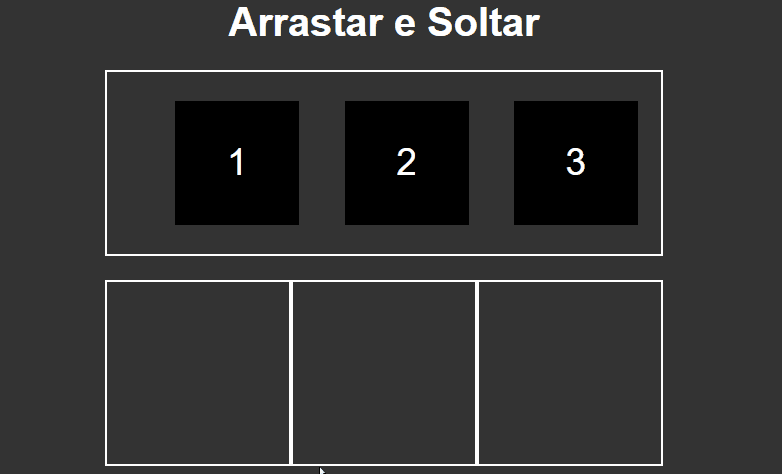

# README

<h1 align="center">Drag and Drop</h1>


<p align="center">
    <a href="#sobre">Sobre</a>
    |
    <a href="#tecnologias">Tecnologias</a>
    |
    <a href="#autor">Autor</a>
    |
    <a href="#rodando_front">Rodando o Front End</a>
    |
    <a href="#prereq">Pré-requisitos</a>
</p>

 ### Features

 - [x] Uso da função Drag
 - [x] Criação de Matriz e modificação da mesma
 - [x] Finalização do projeto

------

<h4 align="center">Exemplo do projeto rodando:</h4>
<br>

<h1 align="center"> 
 
</h1>


# Sobre

- Este projeto é um desafio do curso de Java Script da B7Web, onde o intuito dele é aprender a mecher com a função drag do JS, onde não é uma coisa tão complicada mas nem muito facil. Eu demorei em media quatro dias para finaliza-lo. Eu fiz esse projeto do zero sem acompanhamento do professor, esse projeto é o ultimo desafio do curso então terminando ele eu completo o curso de Java Script da B7Web >:D

### ✋ Pré-requisitos

Antes de começar, você vai precisar ter instalado em sua máquina apenas o [VsCode] (https://code.visualstudio.com/)

### 🎲 Rodando o Front End

```bash 
#Abra seu terminal do VSCode usando ctrl + "

# Clone o repositório
git clone <>

#Baixe a extensão "Live server clicando no canto superior esquerdo"

#No diretorio va no HTML, clique com o botão direito e abra com Live Server
```
### 🛠 Tecnologias
 As seguintes ferramentas foram usadas na construção do projeto:

 - [Javascript](https://www.javascript.com)

----------------

### 👦 Autores
Javascript by: Ariel Rigo [See my Linkedin](https://www.linkedin.com/in/ariel-rigo-588682228/)

Html & Css by: Bonieky Lacerda [Youtube Channel](https://www.youtube.com/c/BoniekyLacerdaLeal)